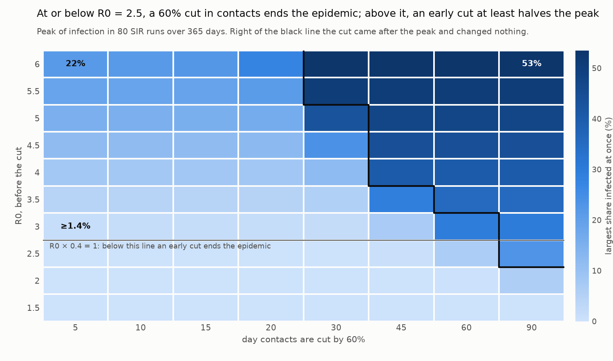

# campaign

[](https://github.com/valentinmann/campaign/actions/workflows/ci.yml?query=branch%3Amain)
[](pyproject.toml)
[](LICENSE)

Running a parameter sweep is the easy part. The hard part comes after: knowing
which of the runs can be trusted, rerunning only what is missing without
silently reusing something stale, and being able to say exactly what produced
a given table. This package runs a sweep described in one YAML file, locally
or as SLURM job arrays, checks every run against invariants the physics says
cannot fail, and writes one table, one manifest and one validation report.
Running it again skips every simulation that is still valid and re-checks
all of them.



## Run it

```bash
git clone https://github.com/valentinmann/campaign.git
cd campaign
python -m venv .venv
source .venv/bin/activate        # Windows: .venv\Scripts\activate
pip install -e ".[demo]"
campaign run demo/sir.yaml
python demo/plot.py
```

No data to download and no network needed once installed. The demo sweeps an
SIR epidemic over ten transmission rates and eight days on which contacts are
cut, 80 runs, a few seconds on a laptop:

```
campaign sir-intervention: 80 scenarios, 0 already done, 80 to run (local)
80 succeeded, 0 failed an invariant, 0 raised, 0 without a result (of 80)
```

Run it a second time and nothing is simulated, every run is checked again, and
the results table comes out identical to the byte:

```
campaign sir-intervention: 80 scenarios, 80 already done, 0 to run (local)
```

## What a campaign file says

```yaml
name: sir-intervention
model: sir.py:simulate            # a plain function in a plain file
seed: 20260928
output: ../results/sir
grid:
  beta: {start: 0.15, stop: 0.6, num: 10}
  t_intervention: [5, 10, 15, 20, 30, 45, 60, 90]
constants: {gamma: 0.1, reduction: 0.6, population: 1.0e6, initial_infected: 10.0, t_end: 365.0}
invariants:
  - {check: conserved, series: [S, I, R], rtol: 1e-9}
  - {check: nonnegative, series: [S, I, R], atol: 1e-6}
  - {check: monotone, series: R, direction: increasing, atol: 1e-6}
```

The model returns its series, which the invariants are checked against, and
its metrics, which become one row of the table. `--backend slurm` submits the
same campaign as job arrays; `--wait` blocks until they end, and
`campaign report` collects them otherwise. Full example:
[`demo/sir.yaml`](demo/sir.yaml).

## The design, in four decisions

**Start with [`src/campaign/results.py`](src/campaign/results.py).** Every
completed run keeps its raw series, and the invariants are re-checked against
them every time the campaign is aggregated; the verdict is never cached.
Resume skips simulations, never checks. Tighten a tolerance and rerun, and
runs that passed before are re-examined without being simulated again. A test
does exactly that and checks that not one stored file was rewritten.

**Scenarios are identified by content, not position**
([`src/campaign/config.py`](src/campaign/config.py)). The identifier hashes the
model reference and the parameters. With positional identifiers, inserting one
value at the front of a grid would shift every index, and a resumed campaign
would skip the wrong scenarios without a word. Seeds are derived the same way,
so they do not depend on the order runs execute in or how many workers share
them.

**Unfinished must look unfinished**
([`src/campaign/store.py`](src/campaign/store.py)). Every file is written
atomically, the record after the series, and a rerun deletes the old record
before it starts. A run is finished only if its record matches the current
parameters, seed and model file and its series can still be read. A run
killed at any point, or damaged on disk, is simply run again.

**The SLURM path is tested as far as it can be without a cluster.** The tests
run against a stub `sbatch` written from the
[sbatch manual](https://slurm.schedmd.com/sbatch.html): `--parsable` answers
`id` or `id;cluster`, array indices stop at `MaxArraySize - 1` (1001 by
default, so larger campaigns are split into several arrays), and `--wait`
exits with the highest exit code of any task. With `--wait` the stub runs the
generated job script through bash, once per index, and the script runs the
real `campaign run-one`; only the scheduler is pretended. The output directory
in those tests has a space in its name on purpose.

## What the tests caught

```bash
pytest                                  # 220 tests, including the docstring examples
pytest --cov --cov-report=term-missing  # 96% line and branch coverage
nox                                     # lint, strict types and tests: exactly what CI runs
```

Those numbers are what those commands print on a clean clone. Four things
found while building this, each of which produced output that looked fine:

1. **Resume trusted the record alone.** A sound `record.json` next to a
   truncated series archive counted as finished, so that run was skipped on
   every resume and, since checks read the series, could never be checked
   again. Found while writing the aggregator, which had nothing to read;
   fixed in its own commit, with a regression test that fails before it.

2. **A leaked file handle, in numpy's error path.** Given the path of a
   truncated archive, `np.load` opens the file and raises before handing the
   handle to anything that closes it. On Windows an open handle blocks
   rewriting the file when the run is redone. The suite runs with warnings as
   errors and failed on the unclosed file; the store now opens files itself.

3. **The demo's peak was wrong, and no invariant could see it.** The peak
   was the largest of the start, the dI/dt = 0 events and the intervention
   day, and forgot the end of the horizon. An epidemic slowed but still
   growing on day 365 reported 27 people as its peak, when it had reached
   13,751 by then. The series were right; only the metric was not. It showed up in the first table of results, read
   before writing the figure's title. The figure now labels that one run as a
   lower bound, and a test asserts the reported peak is never below any
   sample.

4. **The demo's first run failed its own invariants, correctly.** Declared
   with no tolerance, non-negativity and the two monotone checks failed 11 of
   80 runs: `I` reached -2.2e-8 persons, never before day 330, when infection
   is below the integrator's absolute tolerance of 1e-6 persons. That is the
   solver's stated precision, not a bug, so the checks now allow exactly that
   and no more. A test pins them to the model's own tolerance, and three
   tests hand them a one-person bug, a person lost, a compartment below zero,
   a recovery undone, and see each caught.

The type checker found a fifth before anything ran: `np.savez` takes arrays
as keyword arguments next to its own `file` and `allow_pickle`, so a model
returning a series named `file` would have crashed the write.

## What this does not do

- **It has never run on a real cluster.** The SLURM path is tested against a
  stub built from the documentation, running the real job script; a real
  scheduler, queue and file system may still disagree with it.
- Only SLURM. No PBS, LSF or cloud batch service.
- Only the model file is hashed. Editing it reruns everything it produced;
  editing a module it imports does not, and resume would reuse the old runs.
- The invariant vocabulary is closed on purpose: `finite`, `nonnegative`,
  `conserved`, `monotone`, applied within one run. No expressions, and no
  invariants across runs, such as monotonicity in a parameter.
- Scenarios come from a grid or an explicit list. No random or Latin
  hypercube sampling.
- A model error is recorded and retried on the next run; there is no retry
  policy and no per-run timeout.
- Every run's series are stored in full so they can be re-checked. For long
  series across many runs, that is the disk cost of the design.
- The demo model is deterministic, so the seed each run receives changes
  nothing there; seed handling is tested with a stochastic test model.
- The git commit in the manifest is read when the manifest is written, not
  when the runs happened. What ran is pinned by the model file's hash, which
  each run records.
- It is not a workflow engine: no dependencies between steps.
  [Snakemake](https://snakemake.readthedocs.io),
  [Nextflow](https://www.nextflow.io),
  [signac](https://signac.io) and
  [submitit](https://github.com/facebookincubator/submitit) are mature and do
  far more; this is a small, heavily tested implementation of one pattern.

## Development

```bash
nox              # lint, types, tests
nox -s tests     # tests on every installed interpreter, 3.11 to 3.13
nox -s coverage  # the coverage report quoted above, through nox
nox -s demo      # run the demo campaign and redraw the figure
nox -s build     # build the distributions and validate their metadata
```

Checks in place: `ruff` with the Scientific Python rule set plus bandit's
security checks, `ruff format`, `mypy --strict` over the package and the demo,
`pytest` with warnings promoted to errors and docstring examples executed, and
`pre-commit` running all of it plus `typos` and `zizmor`. See
[CONTRIBUTING.md](CONTRIBUTING.md).

## Provenance

Built with an AI coding assistant. The design is mine: what a run has to
prove before it counts as finished, which invariants are worth declaring,
and the decision to keep the demo's failed first run in the record rather
than quietly loosening the checks until it passed.
